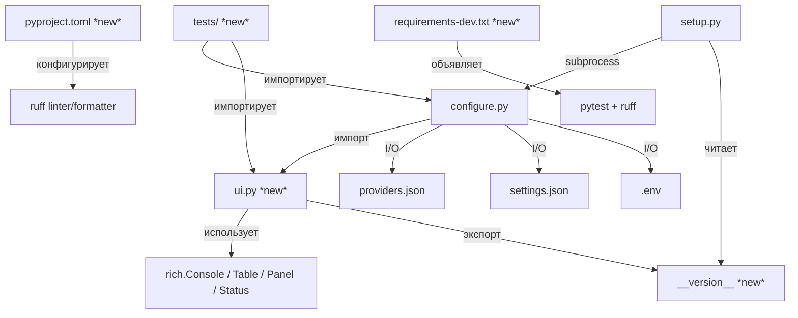
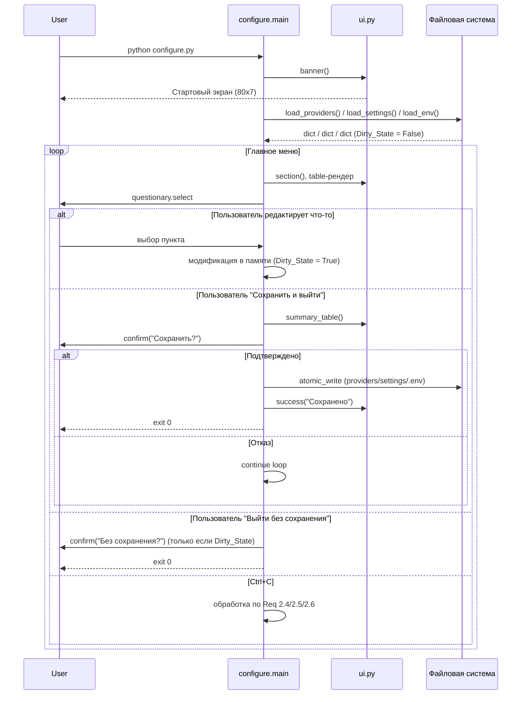
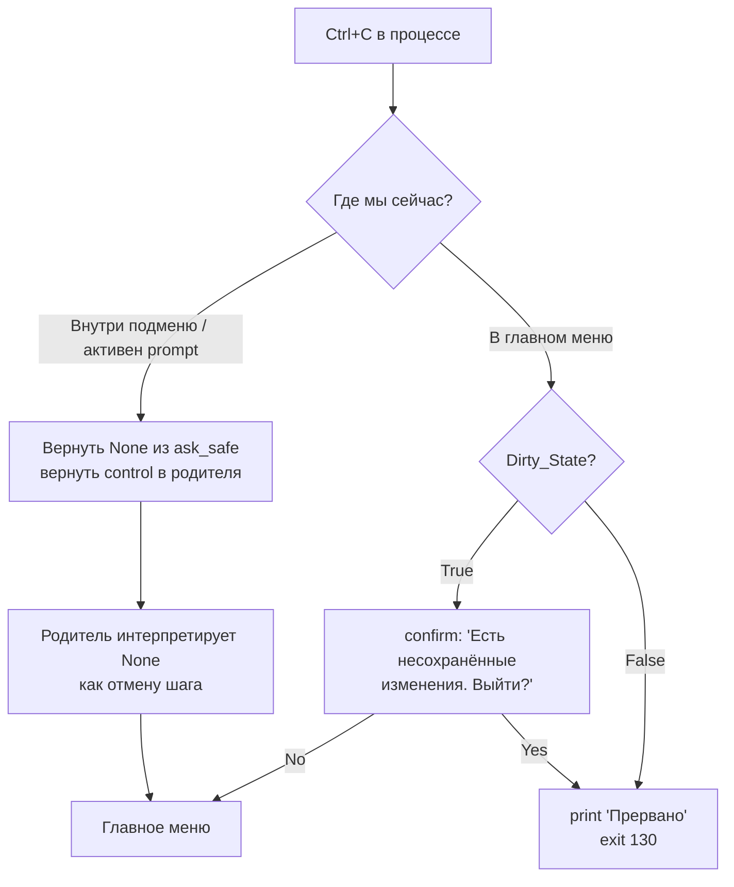
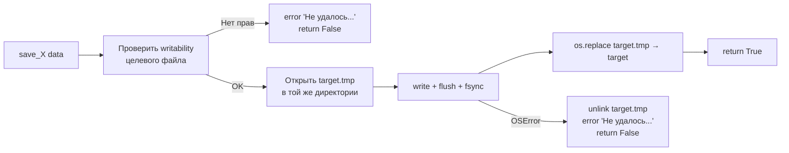

# Design Document: pre-release-polish

## Overview

Фича `pre-release-polish` решает две связанные задачи в одной итерации:

1. **Критический фикс** бага `manage_models` в `configure.py`, где смешение `None`-sentinel для Ctrl+C и числового `value` для выбора провайдера делает невозможным отличить отмену от валидного индекса `0`.
2. **Инфраструктурный и визуальный полиш** CLI-инструмента (`configure.py` + `setup.py`) до уровня, пригодного для публикации первого релиза: единый UI-модуль, унифицированный flow отмены/выхода, атомарная запись конфигов, smoke-тесты, линтер, версионирование, Troubleshooting-раздел в README.

Дизайн намеренно консервативен по отношению к рантайму бота: ни `bot.py`, ни `pipeline.py`, ни `agents.py` не затрагиваются. Все изменения локализованы в слое CLI/инфраструктуры.

### Ключевые дизайн-решения

| Решение | Почему |
|---|---|
| Выделенный модуль `ui.py` вместо inline `console.print("[green]...")` | Централизованная палитра + возможность `NO_COLOR`-режима без правок десятков мест |
| `"__back__"` как Back_Sentinel вместо `None` | Устраняет коллизию с Ctrl+C, который questionary возвращает как `None` |
| Атомарная запись через `os.replace` | JSON-конфиг никогда не остаётся полупустым при `OSError`/kill в середине записи |
| Константа `__version__` в `ui.py`, а не в отдельном `__init__.py` | Проект — плоский набор скриптов, не пакет; отдельный `__init__.py` бессмыслен |
| Smoke-тесты через `pytest` + fixtures с `tmp_path` | Тестируем I/O конфигов в изолированной директории, без моков |
| Обратная совместимость — не менять формат `providers.json`/`settings.json`/`.env` | Пользователи с уже заполненными конфигами не должны ничего переделывать |
| Без создания `__init__.py` в корне | Проект не является пакетом, добавление `__init__.py` сломает текущий способ запуска скриптов (`python configure.py` в рабочей директории) |

### Явно вне scope (из требований)

- Изменения в `bot.py`, `main.py`, `pipeline.py`, `agents.py`, `prompts.py`, `providers.py`, `config.py`
- i18n (остаёмся на русском, но строки выносим в константы)
- Файловое логирование
- Авто-создание `CHANGELOG.md`

## Architecture

### Высокоуровневая схема модулей после рефакторинга



### Поток данных при типичной сессии Configure_CLI



### Flow обработки Ctrl+C

Самая тонкая часть дизайна — унификация Ctrl+C. Текущий код оборачивает `main()` один раз в `try/except KeyboardInterrupt` на верхнем уровне, что превращает Ctrl+C в любом вложенном меню в немедленный exit. По требованиям 2.4–2.6 поведение должно быть двухуровневым:



Реализация через два механизма:

1. **`ask_safe(prompt)`** — тонкая обёртка вокруг `questionary_prompt.ask()` в `configure.py`, которая ловит `KeyboardInterrupt` (бросаемый questionary при Ctrl+C в некоторых окружениях) и возвращает `None`. В окружениях, где questionary сам возвращает `None` при Ctrl+C, обёртка просто прокидывает это значение.
2. **Sentinel `_SIGINT_IN_MAIN_MENU`** — флаг на уровне модуля, который `main()` выставляет в `True` только на время активного prompt в главном меню и сбрасывает в `False` при заходе в подменю. На верхнем уровне `signal.signal(SIGINT, handler)` не используется (это ломает questionary); вместо этого главное меню оборачивается в ещё один `try/except KeyboardInterrupt`, который уже применяет правила 2.4/2.6.

### Атомарная запись конфигов



Проверка writability делается через `os.access(path, os.W_OK)` если файл существует, иначе — `os.access(parent_dir, os.W_OK)`. Это соответствует Req 6.6: проверяем ДО создания `.tmp`.

### Структура директорий после рефакторинга

```
Golovach-feat-ai-team-bot/
├── ui.py                    ← новый модуль (палитра, хелперы, __version__, banner)
├── configure.py             ← рефакторинг: импорт из ui, ask_safe, Dirty_State, atomic_write
├── setup.py                 ← импорт __version__ из ui (fallback на "0.1.0")
├── pyproject.toml           ← новый (ruff config)
├── requirements.txt         ← без изменений (runtime deps)
├── requirements-dev.txt     ← новый (pytest, ruff)
├── README.md                ← расширение: Troubleshooting, Скриншоты, Требования, Версия, Разработка
├── tests/
│   ├── conftest.py          ← новый (fixtures: tmp_config_dir)
│   ├── test_smoke_import.py ← новый (Req 10.2)
│   ├── test_config_io.py    ← новый (Req 10.3–10.6)
└── …остальные файлы без изменений
```

## Components and Interfaces

### Module: `ui.py` (новый)

```python
# ui.py — единая точка визуальных хелперов и версии

from __future__ import annotations
import os
import sys
from contextlib import contextmanager
from rich.console import Console
from rich.panel import Panel
from rich.table import Table
from rich import box

__version__ = "0.1.0"

# --- Castle_Palette ---
COLOR_PRIMARY = "steel_blue1"
COLOR_SUCCESS = "green3"
COLOR_WARN    = "yellow3"
COLOR_ERROR   = "red3"
COLOR_DIM     = "grey50"
COLOR_ACCENT  = "grey70"
COLOR_BORDER  = "grey37"
BOX_STYLE     = box.SQUARE   # каменная кладка

# --- Строковые константы (под будущую i18n) ---
MSG_PREFIX_SUCCESS = "✓"
MSG_PREFIX_WARN    = "⚠"
MSG_PREFIX_ERROR   = "✗"
MSG_PREFIX_INFO    = "ℹ"
MSG_PREFIX_HINT    = "▸"
MSG_PREFIX_SUCCESS_PLAIN = "[OK]"
MSG_PREFIX_WARN_PLAIN    = "[!]"
MSG_PREFIX_ERROR_PLAIN   = "[X]"
MSG_PREFIX_INFO_PLAIN    = "[i]"
MSG_PREFIX_HINT_PLAIN    = "[>]"

TXT_HOTKEYS = "↑/↓ навигация, Enter выбор, Ctrl+C выход"
TXT_BANNER_TITLE    = "Golovach"
TXT_BANNER_SUBTITLE = "AI-команда агентов"

def _is_no_color() -> bool:
    """NO_COLOR по конвенции https://no-color.org, либо stdout не TTY."""
    try:
        if os.environ.get("NO_COLOR") is not None:
            return True
        return not sys.stdout.isatty()
    except Exception:
        return False  # Req 3.15

console: Console = Console(
    no_color=_is_no_color(),
    highlight=False,
    force_terminal=not _is_no_color() or None,
)

def _prefix(kind: str) -> str: ...
def info(msg: str) -> None: ...
def success(msg: str) -> None: ...
def warn(msg: str) -> None: ...
def error(msg: str) -> None: ...
def hint(msg: str) -> None: ...
def section(title: str) -> None: ...
def banner() -> None: ...

@contextmanager
def spinner(text: str):
    """rich.status если TTY и цвета, иначе одноразовый info()."""
    ...
```

### Интерфейс `ui.banner()`

ASCII-эскиз баннера (в No_Color_Mode — без рамки Unicode, только пробелы и `+-|`):

**Цветной режим (рамка `box.SQUARE`, цвет `COLOR_BORDER`, текст `COLOR_PRIMARY`):**

```
┌──────────────────────────────────────────────────────────────────────────────┐
│                                                                              │
│                            Golovach v0.1.0                                   │
│                            AI-команда агентов                                │
│                                                                              │
│                  ↑/↓ навигация, Enter выбор, Ctrl+C выход                    │
│                                                                              │
└──────────────────────────────────────────────────────────────────────────────┘
```

**No_Color_Mode (чистый ASCII, ≤ 80 колонок, 7 строк):**

```
+----------------------------------------------------------------------------+
|                                                                            |
|                          Golovach v0.1.0                                   |
|                          AI-komanda agentov                                |
|                                                                            |
|               ^/v navigatsiya, Enter vybor, Ctrl+C vyhod                   |
+----------------------------------------------------------------------------+
```

*Примечание: в No_Color_Mode Unicode-текст «AI-команда агентов» заменяется на латинскую транслитерацию «AI-komanda agentov» — требование Req 4.4 «только ASCII-символы». Это единственное место в продукте, где применяется транслитерация; все остальные сообщения остаются на русском (в No_Color_Mode они рендерятся как UTF-8 без ANSI-цветов, что терминалы обычно поддерживают — Req 4.4 ограничивает ASCII только сам баннер).*

### Module: `configure.py` (рефакторинг, не переписывание)

Ключевые новые/изменённые функции:

```python
# --- Новые ---
def ask_safe(prompt) -> Any | None:
    """Обёртка questionary.ask: ловит KeyboardInterrupt → None, прочие → error + None."""

def atomic_write(path: Path, content: str) -> bool:
    """Req 6.5, 6.6: проверка writability → tmp → os.replace. True при успехе."""

def _is_writable(path: Path) -> bool: ...

# --- Изменённые ---
def manage_models(providers: list[dict]) -> None:
    """Req 1: Choice(..., value=str(i)) + Back_Sentinel '__back__'."""

def main() -> None:
    """Req 2, 4, 11: ui.banner() один раз, Dirty_State, двухуровневый Ctrl+C, summary перед save."""

# --- Состояние главного цикла ---
BACK = "__back__"  # Back_Sentinel (Req 2.1)
```

### Module: `setup.py` (минимальный патч)

```python
try:
    from ui import __version__  # Req 8.3
except Exception:
    __version__ = "0.1.0"

# В баннере: заменить жёстко-кодированный заголовок на f"║     Golovach v{__version__} ..."
```

Больше никаких изменений в `setup.py` — текущая логика создания venv, установки deps, запуска configure работает и остаётся.

### Module: `tests/conftest.py` (новый)

```python
import pytest
from pathlib import Path

@pytest.fixture
def tmp_config_dir(tmp_path, monkeypatch):
    """Изолирует ROOT для configure.py — все load_/save_ идут в tmp_path."""
    import configure
    monkeypatch.setattr(configure, "ROOT", tmp_path)
    monkeypatch.setattr(configure, "ENV_PATH", tmp_path / ".env")
    monkeypatch.setattr(configure, "PROVIDERS_JSON", tmp_path / "providers.json")
    monkeypatch.setattr(configure, "SETTINGS_JSON", tmp_path / "settings.json")
    return tmp_path
```

## Data Models

Фича не меняет форматы данных на диске. Ниже — ссылочные схемы, чтобы зафиксировать, что рефакторинг обратно совместим с уже существующими файлами пользователей.

### `providers.json` — без изменений

```json
[
  {
    "name": "groq",
    "base_url": "https://api.groq.com/openai/v1",
    "api_key": "gsk_...",
    "available_models": ["llama-3.3-70b-versatile", "..."],
    "enabled_models":   ["llama-3.3-70b-versatile"]
  }
]
```

### `settings.json` — без изменений

Слияние с `DEFAULT_SETTINGS` (текущее поведение `load_settings`) сохраняется как есть. Это гарантирует, что файлы, записанные старой версией, корректно прочитаются новой.

### `.env` — без изменений

Формат `KEY=VALUE` построчно. Строки с `#` в начале — комментарии. Req 6.3 добавляет к текущему парсеру только подсчёт пропущенных строк — **не меняя формат файла**.

### Обратная совместимость (явно)

| Артефакт | Старая версия пишет | Новая версия читает | Новая версия пишет | Старая версия читает |
|---|---|---|---|---|
| `providers.json` | `json.dumps(..., indent=2)` | да (одинаковый парсер) | `atomic_write` + та же `json.dumps` | да (тот же формат) |
| `settings.json` | то же | да | то же | да |
| `.env` | `KEY=VALUE\n` | да (с warning на невалидных) | тот же формат | да |

**Гарантия:** пользователь, у которого уже есть рабочие `providers.json` + `settings.json` + `.env` от текущей версии, после установки новой версии запускает `python configure.py` и видит все свои данные без ручной миграции.

### In-memory data model Configure_CLI

```python
@dataclass
class CliState:
    providers: list[dict]       # load_providers()
    settings:  dict             # load_settings()
    env:       dict[str, str]   # load_env()
    role_map:  dict[str, str]   # derived from env
    dirty:     bool = False     # Req 2.4, 11 — Dirty_State
```

Реально отдельный класс не обязателен — эти поля остаются как локальные переменные в `main()`, а `dirty` добавляется как одна локальная переменная. Структура выше описывает, какие мутирующие операции поднимают флаг:

- добавление/редактирование провайдера → `dirty = True`
- изменение `enabled_models` → `dirty = True`
- изменение `role_map` → `dirty = True`
- изменение любого `settings[...]` → `dirty = True`
- изменение `env["TELEGRAM_BOT_TOKEN"]` / `env["ADMIN_IDS"]` → `dirty = True`
- успешное сохранение → `dirty = False`

## Correctness Properties

*Свойство — это характеристика или поведение, которое должно оставаться истинным во всех корректных исполнениях системы; по сути, формальное утверждение о том, что система должна делать. Свойства — мост между человекочитаемой спецификацией и машинно-проверяемыми гарантиями корректности.*

### PBT-оценка этой фичи

Большая часть фичи `pre-release-polish` — это UI/UX работа (палитра, баннер, меню), структурные рефакторинги (вынос `ui.py`, замена sentinel `None` → `"__back__"`) и точечные фиксы конкретных branch'ей. Для этих частей property-based testing не даёт выигрыша по сравнению с example-тестами.

Однако **в фиче есть реальный кодек-слой**: чтение/запись `providers.json`, `settings.json`, `.env` и низкоуровневая `atomic_write`. Это классическая территория для PBT — сериализация/десериализация должна быть round-trip по определению, и ввод здесь действительно бесконечен (любые unicode-строки в именах, URL, API-ключах, путях моделей; любые комбинации валидных и мусорных строк в `.env`).

### Property 1: `.env` round-trip (save → load сохраняет все валидные пары)

*For any* словаря `d: dict[str, str]`, где ключи — непустые строки без `=` и без управляющих символов, а значения — строки без символов переноса строки, после `save_env(d)` с последующим `load_env()` результат должен быть словарём, равным `d` с точностью до применённого `strip()` и снятия окружающих кавычек (поведение текущего парсера).

**Validates: Requirements 10.5**

### Property 2: `.env` robustness к смешанному содержимому

*For any* последовательности строк, состоящей из валидных пар `KEY=VALUE` и произвольных «мусорных» строк (без `=`, пустых, с ведущими пробелами), после записи этой последовательности в файл `.env` и последующего `load_env()` результат должен:
1. содержать все валидные пары и только их;
2. не бросать исключений;
3. вывести в Rich_Console ровно одно итоговое предупреждение со счётчиком пропущенных строк, равным количеству мусорных строк.

**Validates: Requirements 6.3**

### Property 3: `providers.json` save/load round-trip

*For any* валидного списка провайдеров — списка словарей с полями `name: str`, `base_url: str`, `api_key: str`, `available_models: list[str]`, `enabled_models: list[str]`, где все строки являются валидным JSON-контентом (unicode допустим), — после `save_providers(ps)` с последующим `load_providers()` результат должен быть равен `ps`.

**Validates: Requirements 10.3**

### Property 4: `settings.json` save/load round-trip

*For any* словаря настроек, полученного мутацией `DEFAULT_SETTINGS` (изменение значений существующих ключей, включая вложенные в `temperature` / `max_tokens` / `custom_prompts`), после `save_settings(s)` с последующим `load_settings()` результат должен быть равен `s`.

**Validates: Requirements 10.4**

### Property 5: `atomic_write` сохраняет целостность содержимого

*For any* строки `content` и пути `path` в writable директории, после успешного `atomic_write(path, content)` файл `path` должен содержать ровно `content` (побайтово после UTF-8 кодирования), и временный файл `path.tmp` не должен существовать на диске после завершения вызова.

**Validates: Requirements 6.5**

## Error Handling

### Матрица ошибок и реакций

| Источник ошибки | Тип | Реакция | Требование |
|---|---|---|---|
| `providers.json`: невалидный JSON | `json.JSONDecodeError` | `warn("Файл providers.json повреждён: <причина>. Использую пустой список.")` → продолжить с `[]`, не трогать другие файлы | 6.1 |
| `settings.json`: невалидный JSON | `json.JSONDecodeError` | `warn("Файл settings.json повреждён: <причина>. Использую значения по умолчанию.")` → `DEFAULT_SETTINGS` | 6.2 |
| `.env`: строка без `=` | — | skip + инкремент счётчика → один итоговый `warn("Пропущено строк в .env: N")` | 6.3 |
| Запись любого конфига: `OSError` | `OSError` | `error("Не удалось сохранить <file>: <причина>")` → вернуться в главное меню, Dirty_State не сбрасывать | 6.4 |
| Файл не writable | — | проверка `_is_writable` ДО создания `.tmp` → `error` → skip | 6.6 |
| `questionary.ask()` бросает не-`KeyboardInterrupt` | `Exception` | `error("Ошибка ввода: <краткое описание>")` → возврат в главное меню | 2.7 |
| `fetch_models`: сеть/HTTP | любое | `warn("Ошибка: <e>")` → `return []` (как сейчас) | — (сохраняем текущее поведение) |
| `fetch_models` вернул `[]` после обновления | — | `warn("Моделей не найдено")` → НЕ писать `enabled_models = []` | 1.7 |
| Ctrl+C в подменю | `KeyboardInterrupt` / `None` | возврат в родителя (через `ask_safe` или внутренний `try/except`) | 2.5 |
| Ctrl+C в главном меню + Dirty | — | `confirm("Есть несохранённые изменения. Выйти без сохранения?")` | 2.4 |
| Ctrl+C в главном меню + !Dirty | — | `print("Прервано")` + `sys.exit(130)` | 2.6 |
| `CHANGELOG.md` существует, но не Keep-a-Changelog | — | silent skip, не блокировать сохранение | 8.7 |
| `NO_COLOR` не удаётся прочитать | `OSError` на `os.environ` | fallback: цвета ВКЛ, продолжить | 3.15 |

### Коды выхода

| Код | Когда |
|---|---|
| `0` | Успешное сохранение и выход (Req 11.4) или выход без сохранения с !Dirty после подтверждения |
| `130` | Ctrl+C в главном меню, подтверждён или без Dirty (Req 2.4, 2.6) — стандартный SIGINT код |
| `1` | Критический сбой (зарезервирован, в текущем flow не генерируется) |

### Принципы обработки ошибок

1. **Никогда не терять несохранённые данные пользователя** — Dirty_State поддерживается до явного отказа или успешной записи.
2. **Никогда не показывать traceback** конечному пользователю при штатных сценариях (Ctrl+C, битый JSON, нет прав). Traceback допустим только для непредвиденных багов, которые мы не успели классифицировать.
3. **Атомарность «всё или ничего»** при сохранении: если пользователь отказался от подтверждения на любом из шагов валидации (Req 7.4), ни один из трёх конфигов не пишется.
4. **Изоляция ошибок между файлами:** битый `providers.json` НЕ должен триггерить сброс `settings.json`/`.env` в дефолты.


## Testing Strategy

### Test framework and tooling

- **pytest ≥ 7.0** — тест-раннер (Req 10.9)
- **Hypothesis ≥ 6.0** — библиотека property-based testing. Выбрана как стандарт де-факто для PBT в Python-экосистеме; не пишем PBT-фреймворк с нуля (согласно правилу «НЕ имплементировать PBT с нуля»).
- **ruff ≥ 0.4** — линтер/форматтер (Req 12.4)

Эти зависимости декларируются в `requirements-dev.txt` и не попадают в runtime-образ.

### Тестовая пирамида

1. **Smoke-тесты (`tests/test_smoke_import.py`)** — Req 10.2. Один тест, который импортирует `configure`, `ui`, `main`, `bot`, `pipeline`, `providers`, `agents`, `prompts`, `config`. Если любой импорт падает — билд красный.

2. **Unit/example-тесты (`tests/test_config_io.py`, `tests/test_ui.py`, `tests/test_manage_models.py`, `tests/test_flow.py`)** — покрывают:
   - Req 1.1–1.7: `manage_models` с мокнутым `questionary`
   - Req 2.*: flow отмены/выхода, `ask_safe`, Ctrl+C сценарии
   - Req 3.*: UI-хелперы (префиксы, NO_COLOR режим)
   - Req 4.*: размеры баннера, единственность в цикле
   - Req 6.1/6.2/6.4/6.6: обработка битого JSON, OSError, read-only
   - Req 7.*: валидация перед сохранением
   - Req 11.*: сводная таблица и confirm

3. **Property-based тесты (`tests/test_properties.py`)** — ровно 5 тестов, по одному на каждую property из раздела Correctness Properties. Конфигурация для всех PBT:
   - Минимум 100 iterations per test (`@settings(max_examples=100)`)
   - Каждый тест тегирован комментарием формата:
     ```python
     # Feature: pre-release-polish, Property N: <property_text>
     ```

### Маппинг property → PBT-тест

| # | Property | Файл | Функция теста | Hypothesis strategy |
|---|----------|------|---------------|---------------------|
| 1 | `.env` round-trip | `test_properties.py` | `test_env_roundtrip` | `dictionaries(env_key_st, env_value_st)` |
| 2 | `.env` robustness | `test_properties.py` | `test_env_mixed_content` | `lists(one_of(valid_pair_st, garbage_line_st))` |
| 3 | `providers.json` round-trip | `test_properties.py` | `test_providers_roundtrip` | `lists(provider_dict_st)` |
| 4 | `settings.json` round-trip | `test_properties.py` | `test_settings_roundtrip` | `settings_mutation_st(DEFAULT_SETTINGS)` |
| 5 | `atomic_write` preserves content | `test_properties.py` | `test_atomic_write_preserves` | `text()` + `tmp_path` |

**Пример skeleton для Property 3:**

```python
# tests/test_properties.py
from hypothesis import given, settings as h_settings, strategies as st
import configure

provider_st = st.fixed_dictionaries({
    "name":             st.text(min_size=1, max_size=32).map(str.lower),
    "base_url":         st.from_regex(r"https://[a-z0-9.-]{1,40}/v1", fullmatch=True),
    "api_key":          st.text(min_size=1, max_size=64),
    "available_models": st.lists(st.text(min_size=1, max_size=64), max_size=10),
    "enabled_models":   st.lists(st.text(min_size=1, max_size=64), max_size=10),
})

@h_settings(max_examples=100)
@given(st.lists(provider_st, max_size=5))
# Feature: pre-release-polish, Property 3: providers.json save/load round-trip
def test_providers_roundtrip(providers, tmp_config_dir):
    configure.save_providers(providers)
    loaded = configure.load_providers()
    assert loaded == providers
```

### Балансирование unit и property тестов

Принцип: property-тесты покрывают **всё**, что можно сформулировать универсально (в нашем случае — ровно 5 вещей в I/O-слое). Всё остальное — example/edge-case тесты, **и их не надо раздувать**. Большая часть фичи — UI/flow, и для неё достаточно:
- одного example-теста на каждый branch в `manage_models` (Req 1.*)
- одного parametrized теста на каждую точку отмены (Req 2.*)
- одного snapshot-теста на визуальный вывод UI-хелперов

### Запуск

```bash
# Unit + property тесты
pytest tests/ -v

# Только property-тесты
pytest tests/test_properties.py -v

# С увеличенным числом iterations (для релиз-прогона)
pytest tests/ --hypothesis-profile=ci
```

### CI-гарантия (Req 10.7, 12.6)

На релизном коммите:
- `pytest tests/` → exit 0
- `ruff check .` → exit 0
- `ruff format --check .` → exit 0

Во время разработки эти команды MAY возвращать ошибки (Req 10.8, 12.7).
