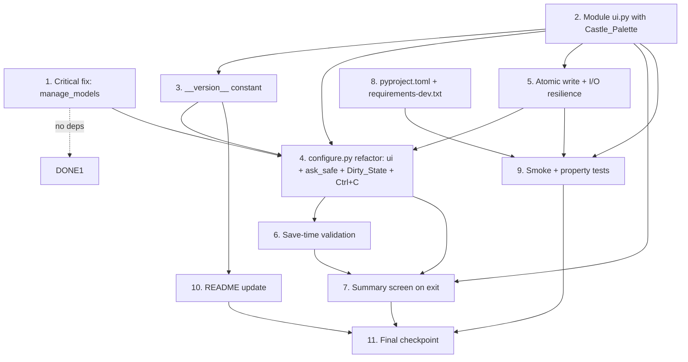

# Implementation Plan: pre-release-polish

## Overview

План реализации фичи pre-release-polish — подготовки проекта Golovach к первому публичному релизу. Задачи разбиты на изолированные блоки, каждый из которых можно выполнить и протестировать независимо. Зависимости между задачами указаны явно в поле «Depends on», что позволяет оркестратору исполнять независимые задачи параллельно.

Язык реализации: **Python 3.10+** (фича не вводит новых языков, работает в рамках существующего кодбейса).

## Task Dependency Graph

```json
{
  "waves": [
    {
      "wave": 1,
      "tasks": ["1", "2", "9"],
      "description": "Independent foundations: critical fix, ui module, dev infra"
    },
    {
      "wave": 2,
      "tasks": ["3", "5"],
      "description": "Depends on ui.py (task 2): version constant + atomic I/O"
    },
    {
      "wave": 3,
      "tasks": ["4", "10"],
      "description": "Depends on ui+version+atomic_write: configure refactor + smoke/property tests"
    },
    {
      "wave": 4,
      "tasks": ["6", "11"],
      "description": "Depends on configure refactor: validation + README"
    },
    {
      "wave": 5,
      "tasks": ["7"],
      "description": "Depends on validation: summary screen"
    },
    {
      "wave": 6,
      "tasks": ["8"],
      "description": "Mid-checkpoint after tasks 1–7"
    },
    {
      "wave": 7,
      "tasks": ["12"],
      "description": "Final release checkpoint"
    }
  ]
}
```

### Visual dependency graph



## Tasks

- [ ] 1. Критический фикс `manage_models` в `configure.py`
  - Заменить `Choice(f"...", i)` на `Choice(f"...", str(i))` при формировании списка провайдеров
  - Заменить `Choice("← назад", None)` на `Choice("← назад", "__back__")` в конце списка
  - Переписать ветку возврата: если результат `None` **или** равен `"__back__"` — `return` без изменений; иначе провайдер получать как `providers[int(value)]`
  - Поправить prompt на `"  Провайдер:"` с двумя ведущими пробелами
  - В ветке «обновить список моделей»: если `fetch_models` вернул пустой список — вывести предупреждение и `return` без записи `enabled_models = []`
  - **Файлы:** `configure.py` (функция `manage_models`, примерно строки 100-115)
  - **Acceptance:** функция больше не падает при выборе первого провайдера; Ctrl+C в prompt возвращает управление в главное меню; `providers.json` на диске не меняется при отмене
  - **Depends on:** нет (самый изолированный блок, может быть первым коммитом)
  - _Requirements: 1.1, 1.2, 1.3, 1.4, 1.5, 1.6, 1.7_

- [ ] 2. Создать модуль `ui.py` с Castle_Palette и хелперами
  - [ ] 2.1 Создать `ui.py` в корне репозитория с импортами `rich.console.Console`, `rich.panel.Panel`, `rich.table.Table`, `rich.box`, `rich.status.Status`, `contextlib.contextmanager`
    - Определить именованные константы `COLOR_PRIMARY = "steel_blue1"`, `COLOR_SUCCESS = "green3"`, `COLOR_WARN = "yellow3"`, `COLOR_ERROR = "red3"`, `COLOR_DIM = "grey50"`, `COLOR_ACCENT = "grey70"`, `COLOR_BORDER = "grey37"`, `BOX_STYLE = box.SQUARE`
    - Определить строковые константы `MSG_PREFIX_SUCCESS="✓"`, `MSG_PREFIX_WARN="⚠"`, `MSG_PREFIX_ERROR="✗"`, `MSG_PREFIX_INFO="ℹ"`, `MSG_PREFIX_HINT="▸"` и их ASCII-эквиваленты `[OK]`, `[!]`, `[X]`, `[i]`, `[>]`
    - Определить `TXT_HOTKEYS`, `TXT_BANNER_TITLE="Golovach"`, `TXT_BANNER_SUBTITLE="AI-команда агентов"`
    - Реализовать `_is_no_color()` с проверкой `os.environ.get("NO_COLOR")` и `sys.stdout.isatty()`, обёрнутую в try/except (при ошибке — возвращать `False`)
    - Экспортировать единственный `console = Console(no_color=_is_no_color(), highlight=False)`
    - **Файлы:** `ui.py` (новый)
    - _Requirements: 3.1, 3.5, 3.6, 3.8, 3.15, 3.16_
  - [ ] 2.2 Реализовать хелперы `info(msg)`, `success(msg)`, `warn(msg)`, `error(msg)`, `hint(msg)` и `section(title)`
    - Каждый хелпер выбирает префикс (emoji или ASCII) в зависимости от `_is_no_color()`
    - Каждый хелпер применяет цвет из Castle_Palette через rich markup
    - `section(title)` выводит заголовок раздела с единообразным стилем (вместо `═ ... ═`)
    - **Файлы:** `ui.py`
    - _Requirements: 3.2, 3.4, 3.7, 3.10, 3.11_
  - [ ] 2.3 Реализовать `spinner(text)` как контекстный менеджер через `@contextmanager`
    - В TTY + цветном режиме использовать `rich.status.Status(text, console=console)`
    - В NO_COLOR или non-TTY — вывести один раз `info(text)` и вести себя как no-op
    - **Файлы:** `ui.py`
    - _Requirements: 3.12, 3.14_
  - [ ] 2.4 Реализовать `banner()` с двумя режимами отображения
    - Цветной режим: `rich.panel.Panel` с `box=BOX_STYLE`, `border_style=COLOR_BORDER`, содержимое — `TXT_BANNER_TITLE` + версия + `TXT_BANNER_SUBTITLE` + пустая строка + `TXT_HOTKEYS`; ширина ≤ 80, высота ≤ 7 строк
    - NO_COLOR режим: ASCII-рамка `+-|`, без цветов, подзаголовок транслитерируется («AI-komanda agentov»), подсказка клавиш также ASCII
    - **Файлы:** `ui.py`
    - _Requirements: 3.3, 4.1, 4.2, 4.3, 4.4, 4.5_
  - [ ]* 2.5 Unit-тесты для UI-хелперов
    - Capture output через `console.capture()` и assert присутствие префиксов/цветов
    - Parametrized: проверить все 5 хелперов для обоих режимов (NO_COLOR on/off)
    - Тест размера баннера: render в Console(width=80), assert `max(len(line) for line in lines) <= 80 and len(lines) <= 7`
    - Тест ASCII-режима: `all(ord(c) < 128 for c in banner_output)` при NO_COLOR=1
    - **Файлы:** `tests/test_ui.py` (новый)
    - _Requirements: 3.10, 3.11, 4.3, 4.4_
  - **Depends on:** нет

- [ ] 3. Добавить константу `__version__` в `ui.py`
  - Добавить строку `__version__ = "0.1.0"` в начало `ui.py`, сразу после импортов
  - Использовать её в `banner()` при рендеринге заголовка (`f"{TXT_BANNER_TITLE} v{__version__}"`)
  - **Файлы:** `ui.py`
  - **Acceptance:** `from ui import __version__` возвращает `"0.1.0"`; баннер содержит строку `v0.1.0`
  - **Depends on:** 2 (нужен `ui.py`)
  - _Requirements: 8.1, 8.2, 8.4_

- [ ] 4. Рефакторинг `configure.py` под `ui` + унифицированный Ctrl+C
  - [ ] 4.1 Добавить в `configure.py` импорты `from ui import console, info, success, warn, error, hint, section, spinner, banner, __version__`
    - Удалить локальный `console = Console()` и прямые импорты `rich.console.Console`
    - Заменить все `console.print("[green]...[/green]")` на `success(...)`, `[yellow]` на `warn(...)`, `[red]` на `error(...)`, `[dim]` на `hint(...)`/`info(...)`
    - Заменить все `console.print("\n[bold cyan]═ ... ═[/bold cyan]")` на `section(...)`
    - В `main()` первой строкой вызвать `banner()` (однократно, ДО цикла while)
    - Добавить одну строку подсказки `TXT_HOTKEYS` под баннером (тоже один раз)
    - **Файлы:** `configure.py`
    - _Requirements: 3.9, 4.1, 4.6, 5.1, 5.2, 5.6, 5.7_
  - [ ] 4.2 Реализовать `ask_safe(prompt)` — обёртку для всех `questionary.*.ask()`
    - Сигнатура: `def ask_safe(prompt) -> Any | None:`
    - Ловит `KeyboardInterrupt` — возвращает специальный sentinel, который вызывающий код отличает от `None` (например, через поднятый флаг `_sigint_caught` в модуле) или просто `None` (упрощение, если семантика Ctrl+C=None устраивает); в финальном дизайне используем `None` + flag модуля `_last_cancel_was_sigint` для различения в главном меню
    - Ловит прочие `Exception` — вызывает `error(f"Ошибка ввода: {e}")` и возвращает `None`
    - Все вызовы `questionary.X(...).ask()` в `configure.py` заменить на `ask_safe(questionary.X(...))`
    - **Файлы:** `configure.py`
    - _Requirements: 2.2, 2.3, 2.7_
  - [ ] 4.3 Заменить все `Choice(..., None)` на `Choice(..., "__back__")` в каждом меню
    - Определить константу `BACK = "__back__"` в модуле
    - Обновить функции `add_provider`, `manage_models` (частично покрыто задачей 1), `assign_roles`, `edit_infra`, главное меню `main` — везде, где был `Choice("← назад", None)`
    - Обновить все проверки после `.ask()`: вместо `if not pick` / `if pick is None` — явно `if pick is None or pick == BACK`
    - **Файлы:** `configure.py`
    - _Requirements: 2.1, 2.8_
  - [ ] 4.4 Реализовать Dirty_State и двухуровневый Ctrl+C flow
    - Ввести в `main()` локальную переменную `dirty: bool = False`
    - Устанавливать `dirty = True` в каждом меню после успешной модификации `providers` / `settings` / `env` / `role_map` (в `add_provider`, `manage_models`, `assign_roles`, `edit_infra`, `tg`-ветке)
    - Обернуть главный цикл в `try: ... except KeyboardInterrupt: ...`
    - В `except` блоке: если `dirty` — вызвать `questionary.confirm("Есть несохранённые изменения. Выйти без сохранения?")`; если отказ — `continue` в цикл; если согласие — `warn("Прервано")` + `sys.exit(130)`
    - Если `!dirty` — сразу `warn("Прервано")` + `sys.exit(130)`
    - Нижний `try/except KeyboardInterrupt` на `if __name__ == "__main__"` оставить как safety net с тем же exit 130
    - **Файлы:** `configure.py`
    - _Requirements: 2.4, 2.5, 2.6_
  - [ ] 4.5 Унифицировать стили таблиц через `BOX_STYLE`
    - Во всех местах создания `Table(...)` в `configure.py` (список провайдеров, список ролей, сводная таблица) указывать `box=BOX_STYLE` и цвета колонок из Castle_Palette
    - Удалить ведущие `"— "` в пунктах главного меню перед «Сохранить и выйти» и «Выйти без сохранения»
    - Добавить `questionary.Separator()` между группами пунктов при необходимости
    - **Файлы:** `configure.py`
    - _Requirements: 5.4, 5.5_
  - [ ] 4.6 Обернуть `fetch_models` и прочие сетевые вызовы в `spinner(...)`
    - Заменить `console.print("  [dim]Ищу модели...[/dim]")` + вызов на `with spinner("Ищу модели..."): models = fetch_models(...)`
    - Проверить `add_provider` и `manage_models` — там где `fetch_models` вызывается
    - **Файлы:** `configure.py`
    - _Requirements: 3.13_
  - [ ]* 4.7 Unit-тесты для `manage_models` (фиксит бага из задачи 1)
    - Parametrized: мокать `questionary.select().ask()` возвращать `None`, `"__back__"`, `"0"`, `"1"`
    - Для `None`/`"__back__"` — assert providers не изменились; для `"0"`/`"1"` — assert функция использует правильного провайдера
    - Edge case: `fetch_models` вернул `[]` после обновления — assert `enabled_models` не был перезаписан
    - **Файлы:** `tests/test_manage_models.py` (новый)
    - _Requirements: 1.3, 1.4, 1.5, 1.7_
  - [ ]* 4.8 Unit-тесты для Ctrl+C flow и `ask_safe`
    - Мокать questionary prompt, чтобы бросить `KeyboardInterrupt` — assert `ask_safe` возвращает `None`
    - Parametrized по исключениям `{ValueError, RuntimeError, IOError}` — assert `ask_safe` возвращает `None` + вызов `error(...)`
    - Интеграционный тест главного меню: симулировать Ctrl+C + `dirty=False` → exit code 130; Ctrl+C + `dirty=True` + подтверждение → exit 130; Ctrl+C + `dirty=True` + отказ → цикл продолжается
    - **Файлы:** `tests/test_flow.py` (новый)
    - _Requirements: 2.4, 2.5, 2.6, 2.7_
  - **Depends on:** 1 (фикс manage_models), 2 (ui модуль), 3 (версия)

- [ ] 5. Атомарная запись конфигов и устойчивость I/O
  - [ ] 5.1 Реализовать `atomic_write(path: Path, content: str) -> bool` в `configure.py`
    - Проверить writability: если файл существует — `os.access(path, os.W_OK)`, иначе `os.access(path.parent, os.W_OK)`; при отсутствии прав — `error("Не удалось сохранить <file>: нет прав на запись")` + return `False`
    - Открыть `path.with_suffix(path.suffix + ".tmp")` для записи (в той же директории)
    - Записать content → flush → `os.fsync(fd)` → close
    - Вызвать `os.replace(tmp_path, path)` (атомарная замена)
    - При `OSError` в любой точке: попытаться удалить `tmp_path`, вызвать `error("Не удалось сохранить <file>: <причина>")`, вернуть `False`
    - Возвращать `True` при успехе
    - **Файлы:** `configure.py`
    - _Requirements: 6.4, 6.5, 6.6_
  - [ ] 5.2 Переключить `save_providers`, `save_settings`, `save_env` на `atomic_write`
    - Каждая функция теперь формирует строку контента и делегирует запись в `atomic_write`; при возврате `False` — возвращает `False` в вызывающий код, чтобы `dirty` не сбросился
    - **Файлы:** `configure.py`
    - _Requirements: 6.4, 6.5_
  - [ ] 5.3 Укрепить `load_providers` и `load_settings` против битого JSON
    - В `load_providers`: при `json.JSONDecodeError` — вызвать `warn(f"Файл providers.json повреждён: {e}. Использую пустой список.")` → return `[]`; явно НЕ трогать settings/env
    - В `load_settings`: при `json.JSONDecodeError` — вызвать `warn(f"Файл settings.json повреждён: {e}. Использую значения по умолчанию.")` → return `{**DEFAULT_SETTINGS}`
    - **Файлы:** `configure.py`
    - _Requirements: 6.1, 6.2_
  - [ ] 5.4 Улучшить `load_env` — подсчёт мусорных строк
    - Считать строки, которые не `strip() == ""`, не начинаются с `#`, но не содержат `=`
    - В конце загрузки, если счётчик > 0 — вызвать `warn(f"Пропущено строк в .env: {counter}")`
    - **Файлы:** `configure.py`
    - _Requirements: 6.3_
  - [ ]* 5.5 Edge-case тесты для I/O resilience
    - Test битого JSON в providers.json: записать строку `"{"`, вызвать `load_providers()`, assert `[]` + warn в outputs; assert settings.json не тронут (sentinel-файл не изменён)
    - Test битого JSON в settings.json: аналогично, assert результат равен `DEFAULT_SETTINGS`
    - Test OSError при записи: `monkeypatch` `open` бросать `PermissionError`, вызвать `save_providers([{...}])`, assert return `False` + error в output + in-memory данные не потеряны
    - Test read-only target: создать файл, `os.chmod(path, 0o444)` (на Windows — `stat.S_IREAD`), вызвать `atomic_write`, assert return `False` + отсутствие `.tmp` файла в директории
    - **Файлы:** `tests/test_io_resilience.py` (новый)
    - _Requirements: 6.1, 6.2, 6.4, 6.6_
  - **Depends on:** 2 (хелперы `warn`/`error` из ui)

- [ ] 6. Валидация конфигурации перед сохранением
  - [ ] 6.1 Реализовать `validate_before_save(providers, settings, env, role_map) -> list[tuple[str, str, bool]]` в `configure.py`
    - Возвращает список кортежей `(поле, статус_строка, is_critical)`:
      - `("TELEGRAM_BOT_TOKEN", "задан" / "ПУСТО", not token)` — если токен пустой, флаг критичности `True`
      - `("Провайдеры", f"{N} шт." / "НЕТ", not providers)`
      - `("Роли", f"{M} назначено" / "НЕТ РОЛЕЙ", all role empty)`
    - В вызывающем коде (ветка `a == "save"`): проход по списку, вывод в формате `  - <поле>: <статус>` (цвет из Castle_Palette в зависимости от критичности)
    - Для каждой критичной строки — запросить `questionary.confirm("Есть предупреждения. Продолжить сохранение?", default=False)`
    - **Файлы:** `configure.py`
    - _Requirements: 7.1, 7.2, 7.3, 7.5_
  - [ ] 6.2 Сделать «всё или ничего» для сохранения
    - Если пользователь ответил «нет» на любом `confirm` — немедленно `return` в главное меню без записи любого из трёх файлов (ни `save_providers`, ни `save_settings`, ни `save_env` не должны быть вызваны)
    - Только после прохождения всех валидаций и финального `confirm("Сохранить?", default=True)` — вызвать три `atomic_write` в порядке: providers, settings, env; при любом `False` в возврате — вывести error и НЕ завершать процесс (оставить dirty)
    - **Файлы:** `configure.py`
    - _Requirements: 7.4, 11.4, 11.5_
  - [ ]* 6.3 Unit-тесты для валидации
    - Parametrized: `(token="", roles_empty=True, providers_empty=True)` комбинации → assert validate_before_save возвращает ожидаемые критические флаги
    - Integration: симулировать save-path с `token=""`, отказ на confirm → assert ни один из трёх файлов не создан и не модифицирован
    - **Файлы:** `tests/test_validation.py` (новый)
    - _Requirements: 7.1, 7.2, 7.3, 7.4_
  - **Depends on:** 4 (ask_safe и основной рефакторинг configure.py)

- [ ] 7. Сводный экран при выходе (summary table)
  - [ ] 7.1 Реализовать `show_summary(providers, settings, env, role_map)` в `configure.py`
    - Создать `Table(box=BOX_STYLE)` с колонками «Параметр» и «Значение»
    - Строки:
      - «Провайдеры» — `f"{len(providers)} шт."`
      - «Активных моделей» — сумма `len(p["enabled_models"])` по всем провайдерам
      - «Роли назначены» — `f"{sum(1 for v in role_map.values() if v)} / 6"`
      - «Telegram token» — `"есть"` / `"нет"` (цвет соответственно)
      - «Admin IDs» — количество (разделить `env.get("ADMIN_IDS","")` по запятой)
    - `console.print(table)`
    - **Файлы:** `configure.py`
    - _Requirements: 11.1, 11.2_
  - [ ] 7.2 Интегрировать `show_summary` в flow сохранения
    - В ветке `a == "save"` главного цикла: вызвать `show_summary(...)` ПЕРЕД `validate_before_save`
    - После валидации — `questionary.confirm("Сохранить?", default=True)`; при согласии — atomic writes + `success("Сохранено! Запускай: python main.py")` + `return` (выход с кодом 0); при отказе — `continue` в цикл (dirty не сбрасывается)
    - **Файлы:** `configure.py`
    - _Requirements: 11.3, 11.4, 11.5_
  - [ ]* 7.3 Тест для сводного экрана
    - Вызвать `show_summary` с известными входами, capture console output, assert содержит строки с правильными числами
    - **Файлы:** `tests/test_summary.py` (новый) или расширение `test_flow.py`
    - _Requirements: 11.1, 11.2_
  - **Depends on:** 2 (ui), 4 (configure refactor), 6 (validate_before_save)

- [ ] 8. Чек-пойнт — убедиться что все тесты из задач 1–7 проходят
  - Запустить `pytest tests/ -v` локально
  - Запустить `python configure.py` и вручную проверить happy path: добавить провайдера, назначить роли, сохранить и выйти
  - Если появляются ошибки — остановиться, спросить пользователя
  - _Depends on: 1, 2, 3, 4, 5, 6, 7_

- [ ] 9. Инфраструктура разработки: `pyproject.toml` + `requirements-dev.txt`
  - [ ] 9.1 Создать `pyproject.toml` в корне
    - Секция `[tool.ruff]` с `line-length = 120`, `target-version = "py310"`, `select = ["E", "F", "W", "I"]`
    - Секция `[tool.ruff.format]` (оставить параметры на дефолтах)
    - **Файлы:** `pyproject.toml` (новый)
    - _Requirements: 12.1, 12.2, 12.3_
  - [ ] 9.2 Создать `requirements-dev.txt` в корне
    - Содержимое:
      ```
      -r requirements.txt
      pytest>=7.0
      hypothesis>=6.0
      ruff>=0.4
      ```
    - **Файлы:** `requirements-dev.txt` (новый)
    - _Requirements: 10.9, 12.4_
  - [ ] 9.3 Прогнать `ruff format .` и `ruff check .` на кодбейсе
    - Применить автофиксы через `ruff check --fix .`
    - Для оставшихся warnings — либо исправить, либо добавить точечные `# noqa: XXX` с обоснованием
    - Убедиться, что на момент этой задачи `ruff check .` возвращает exit 0
    - **Файлы:** все `.py` файлы в корне
    - _Requirements: 12.6_
  - **Depends on:** нет (не требует других задач как prerequisites, но выгоднее после 4/5, чтобы сразу пройти форматирование на финальной версии кода)

- [ ] 10. Smoke + property тесты
  - [ ] 10.1 Создать `tests/conftest.py` с fixture `tmp_config_dir`
    - Fixture монкипатчит `configure.ROOT`, `configure.ENV_PATH`, `configure.PROVIDERS_JSON`, `configure.SETTINGS_JSON` на `tmp_path`
    - **Файлы:** `tests/conftest.py` (новый)
    - _Requirements: 10.1_
  - [ ] 10.2 Создать `tests/test_smoke_import.py`
    - Один тест: `import configure; import ui; import main; import bot; import pipeline; import providers; import agents; import prompts; import config`
    - Не должен бросать исключений
    - **Файлы:** `tests/test_smoke_import.py` (новый)
    - _Requirements: 10.2_
  - [ ] 10.3 Создать `tests/test_properties.py` с 5 property-based тестами через Hypothesis
    - [ ] 10.3.1 **Property 1:** `test_env_roundtrip` — `.env` save → load сохраняет dict
      - Strategy: `dictionaries(keys=env_key_st, values=env_value_st)` где `env_key_st = text(alphabet=string.ascii_letters+"_", min_size=1)` и `env_value_st = text(max_size=200).filter(lambda s: "\n" not in s)`
      - Тег: `# Feature: pre-release-polish, Property 1: .env save/load round-trip (Validates: Requirements 10.5)`
      - Config: `@h_settings(max_examples=100)`
      - _Requirements: 10.5_
    - [ ] 10.3.2 **Property 2:** `test_env_mixed_content` — смесь валидных/мусорных строк
      - Strategy: `lists(one_of(valid_pair_line_st, garbage_line_st), max_size=50)` shuffled
      - Записать всё в `.env`, вызвать `load_env()`, assert: все valid pairs в результате + счётчик warn = len(garbage)
      - Тег: `# Feature: pre-release-polish, Property 2: .env mixed content robustness (Validates: Requirements 6.3)`
      - _Requirements: 6.3_
    - [ ] 10.3.3 **Property 3:** `test_providers_roundtrip` — providers.json round-trip
      - Strategy: `lists(provider_dict_st, max_size=5)` где `provider_dict_st` — `fixed_dictionaries` с полями `name/base_url/api_key/available_models/enabled_models`
      - Тег: `# Feature: pre-release-polish, Property 3: providers.json save/load round-trip (Validates: Requirements 10.3)`
      - _Requirements: 10.3_
    - [ ] 10.3.4 **Property 4:** `test_settings_roundtrip` — settings.json round-trip
      - Strategy: начать с копии `DEFAULT_SETTINGS`, мутировать случайные ключи (в том числе вложенные) через `strategies.sampled_from`
      - Тег: `# Feature: pre-release-polish, Property 4: settings.json save/load round-trip (Validates: Requirements 10.4)`
      - _Requirements: 10.4_
    - [ ] 10.3.5 **Property 5:** `test_atomic_write_preserves` — атомарная запись сохраняет содержимое
      - Strategy: `text()` как content + `tmp_path / "file.json"` как target
      - Вызвать `atomic_write(path, content)`, прочитать `path.read_text("utf-8")`, assert равно content; assert `(path.parent / (path.name + ".tmp"))` не существует
      - Тег: `# Feature: pre-release-polish, Property 5: atomic_write preserves content (Validates: Requirements 6.5)`
      - _Requirements: 6.5_
    - **Файлы:** `tests/test_properties.py` (новый)
  - [ ] 10.4 Добавить `pytest` в CI-способный запуск: документировать команду `pytest tests/` в README (задача 11)
    - Ничего не коммитить тут; проверить, что `pytest tests/ -v` локально даёт exit 0
    - _Requirements: 10.7_
  - **Depends on:** 2 (ui.py существует), 5 (atomic_write существует), 9 (pytest установлен)

- [ ] 11. Обновить README.md
  - [ ] 11.1 Добавить раздел «Требования» (Python ≥ 3.10, ключевые пакеты)
  - [ ] 11.2 Добавить раздел «Скриншоты» с ASCII-превью баннера (взять из design.md) и примером главного меню
  - [ ] 11.3 Добавить раздел «Troubleshooting» с минимум тремя пунктами:
    - Нет `TELEGRAM_BOT_TOKEN` → симптомы + решение
    - Невалидный API-ключ провайдера → симптомы + решение
    - Битый `providers.json` → симптомы + решение
  - [ ] 11.4 Добавить раздел «Версия» с текущим значением `__version__` или badge
  - [ ] 11.5 Добавить раздел «Разработка» с командами `pytest tests/`, `ruff check .`, `ruff format .`
  - [ ] 11.6 Сохранить существующие разделы «Быстрый старт» и «Лицензия»
  - **Файлы:** `README.md`
  - _Requirements: 9.1, 9.2, 9.3, 9.4, 9.5, 9.6, 12.5_
  - **Depends on:** 3 (должна быть известна версия)

- [ ] 12. Финальный чек-пойнт — релизный прогон
  - Запустить `pytest tests/` → должен быть exit 0
  - Запустить `ruff check .` → должен быть exit 0
  - Запустить `ruff format --check .` → должен быть exit 0
  - Вручную пройти полный flow `python setup.py` на чистой директории (fresh venv, пустые конфиги): проверить баннер, добавление провайдера, назначение ролей, сохранение, перезапуск и загрузку сохранённых данных
  - Проверить обратную совместимость: положить `providers.json` и `settings.json` от предыдущей версии, запустить `python configure.py`, убедиться что данные читаются без предупреждений
  - Если что-то не проходит — остановиться и спросить пользователя
  - **Depends on:** 8 (промежуточный checkpoint), 9, 10, 11

## Notes

- Задачи, отмеченные `*` — тестовые sub-tasks, опциональные. Оркестратор может пропустить их для быстрого MVP, но для релиза (задача 12) они должны быть выполнены.
- Каждая задача явно ссылается на конкретные acceptance criteria из `requirements.md` через поле `_Requirements:`.
- Каждая задача указывает затрагиваемые файлы в поле `Файлы:` — это даёт agentу точную картину scope работ.
- Каждая задача указывает свои зависимости в поле `Depends on:` — это формирует DAG для параллельного исполнения независимых веток.
- Property tests (задача 10.3) соответствуют 1:1 свойствам из раздела Correctness Properties в `design.md`. Каждый тест тегирован комментарием нужного формата.
- Обратная совместимость с уже существующими `providers.json`/`settings.json`/`.env` — проверяется в задаче 12 финальным smoke-прогоном.
- Фича не трогает `bot.py`, `pipeline.py`, `agents.py`, `prompts.py`, `providers.py`, `config.py`, `main.py` — эти файлы остаются как есть (только задача 10.2 импортирует их в smoke-тесте, но не модифицирует).
